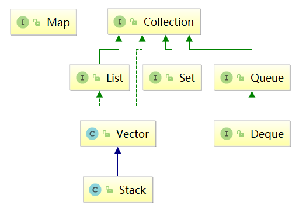

<!-- TOC -->

- [1、unchecked 异常](#1unchecked-异常)
- [2、object下的方法](#2object下的方法)
- [3、git](#3git)
- [4、集合类有哪些](#4集合类有哪些)
- [5、删除节点](#5删除节点)
- [6、定义泛型](#6定义泛型)

<!-- /TOC -->
### 1、unchecked 异常  
将派生于Error或者RuntimeException的异常称为unchecked异常，所有其他的异常成为checked异常。  
unchecked异常不会让你强制处理，但你自己写程序的时候，肯定是要写的，所以个个都要记  

### 2、object下的方法  
有5方面
- 一个是与线程相关的  
    wait notify notifyAll
- 一个是所有类都要重写的
    toString hashCode equals
- 一个是过时的finalize
- 还有就是慎用的clone
- 得到类信息的getClass  

### 3、git

### 4、集合类有哪些
java 集合框架两大顶级接口Collection和Map
Collection里有 List Set Queue ，相对于的栈是一个具体的类


### 5、删除节点

### 6、定义泛型
```java
public class User<T,U>{
```

