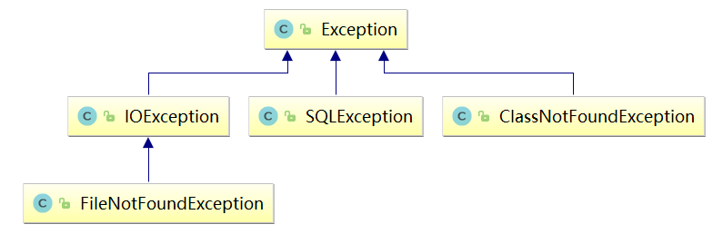

## Error
主要是OutOfMemory还有StackOverFlow

## checked异常
主要是（各种找不到）IO异常，找不到文件，找不到类

## unchecked 异常
由于unchecked(Runtime)异常编译器不会报错，所以都需要手工记
Inspect Code 只能检查很少一部分，传入的参数都不会检查异常。 
 
## unchecked 异常举例
1、ArithmeticException  运算异常  
``` java
res = num1/num2;
```  
2、ClassCastException   类的转换异常
``` java
Object x = new Object();
System.out.println((String)x);
```
3、NullPointerException空指针异常
```java
String str = null;
if(str.equals("test")) {
 }
```
4、IndexOutOfBoundsException数组越界
``` java
int[] aa = {1,2,3};
System.out.println(aa[3]);
```