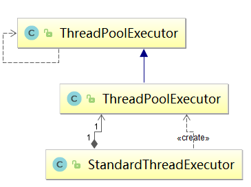

### 1、给线程池添加任务
NioEndpoint.java
```java
SocketProcessor sc = processorCache.pop();
            if ( sc == null ) sc = new SocketProcessor(attachment, status);
            else sc.reset(attachment, status);
            Executor executor = getExecutor();
            if (dispatch && executor != null) {
                executor.execute(sc);
```
### 2、tomcat线程池使用的队列
```java
TaskQueue extends LinkedBlockingQueue<Runnable>
```
### 3、标准线程池策略
核心线程池大小 最大线程池大小
- corePoolSize->addWorker
- taskQueue->offer
- maximumPoolSize ->addWorkrt
- 拒绝策略

具体策略：  
1、如果少于核心线程池大小，尝试新建线程  
2、如果任务被成功加到队列中，二次检查是否要新增一个线程（因为在上次检查的时候可能有线程死了）  
3、在没有超过最大线程池大小时，新建线程  
4、执行拒绝策略  

### 4、tomcat线程池策略  
tomcat线程池是对concurrent下的线程池Executor进行了包装，里面有个成员是继承了jdk线程池Executor。 
这个继承的Executor默认也调用了jdkExecutor的execute，所以默认情况下就是标准线程池策略。   
  
### 5、参数之间的关系  
executor.setMaximumPoolSize(maxThreads);  
executor.setCorePoolSize(minSpareThreads);  
tomcat空闲线程大小就是核心线程池大小   
最大线程数就是最大线程池大小  

存活时间：
executor.setKeepAliveTime(maxIdleTime, TimeUnit.MILLISECONDS);  

### 6、拒绝策略  
就是抛出一个异常  
```java
  private static class RejectHandler implements RejectedExecutionHandler {
        @Override
        public void rejectedExecution(Runnable r,
                java.util.concurrent.ThreadPoolExecutor executor) {
            throw new RejectedExecutionException();
        }

    }
```