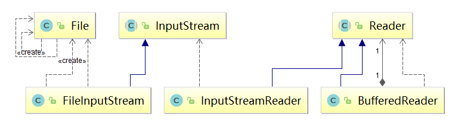

### 常用类

记这两个顺序


### 方式一
File->FileInputStream->InputStreamReader->BufferedReader
FileInput
Reader指定字符格式
再Buffered指定缓冲大小

```java
File file = new File("D:\\01_Git\\Interview\\12_JAVAIO.md");
        FileInputStream fileInputStream = new FileInputStream(file);
        InputStreamReader inputStreamReader = new InputStreamReader(fileInputStream,"UTF-8");
        BufferedReader bufferedReader = new BufferedReader(inputStreamReader);
        System.out.println(bufferedReader.readLine());
```
### 方式二
Paths->Path->Files.newBufferedReader
### 异常
IOException


### Java中的文件和目录管理----Path、Files
抛弃什么File  
用什么Path Paths Files  
1.创建一个路径  
```java
Path path=Paths.get("d:/users/日记5.txt");
```
2、Files基本用法 
```java
Path pathfile=Paths.get("d:/users/日记5.txt");
Files.createFile(pathfile);
```
3、得到File
```java
File f1 = new File(dirname);
```